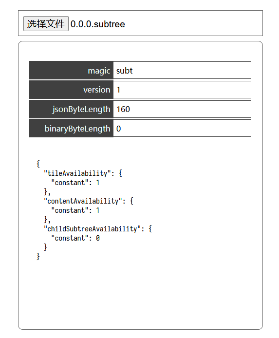

# 这个是什么？

一个简单的页面，能通过上传单个文件的形式，解析 [3D Tiles Next](https://github.com/CesiumGS/3d-tiles/tree/main/next) 中 [3DTILES_implicit_tiling](https://github.com/CesiumGS/3d-tiles/tree/main/extensions/3DTILES_implicit_tiling) 的 `.subtree` 文件，输出其文件头与 JSON 文本。

页面技术采用 vite 作为开发、打包环境，脚本实现使用 typescript 与 css3.

你可以在 [Cesium.JS](https://github.com/CesiumGS/cesium) 库的 `Spec` 目录中找到一些简单的 subtree 文件。

# GitPage

你可以在这里访问成果页面：[GitPage](https://openspacing.github.io/subtree-viewer/)

# 示意图

